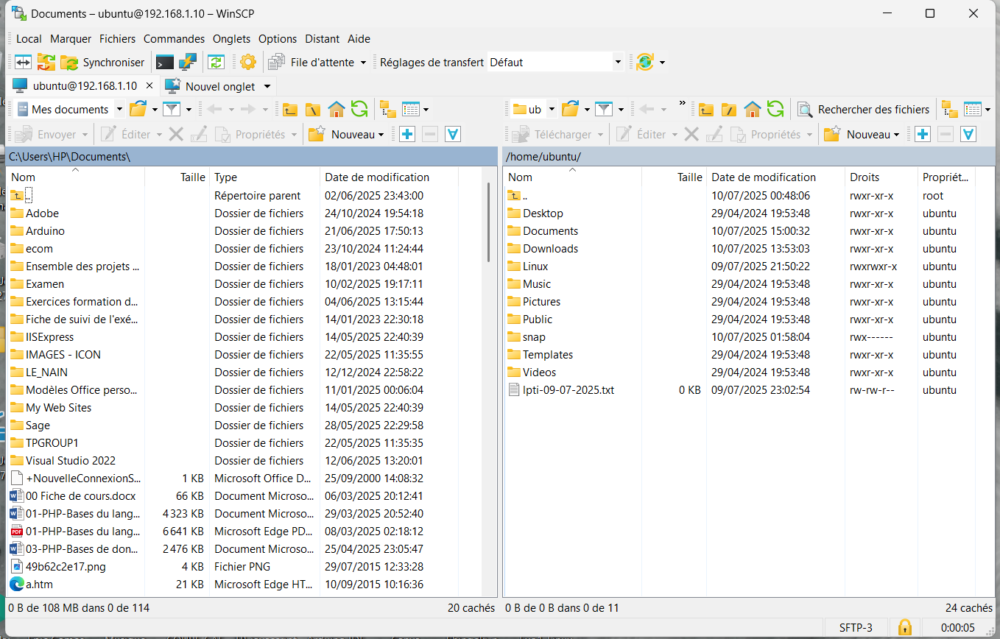

## Projet : Connexion SSH & Transfert avec WinSCP

**Description synthétique :**
Ce projet montre comment se connecter à un serveur distant via SSH et transférer des fichiers avec WinSCP. Il inclut une démonstration visuelle et les étapes principales pour la prise en main.

**Image (paysage) :**

**Image (paysage) :**

**GIF démonstration (<5 s) :**

**Technologies utilisées :**
- WinSCP
- SSH
- Windows
- Gestion de fichiers
